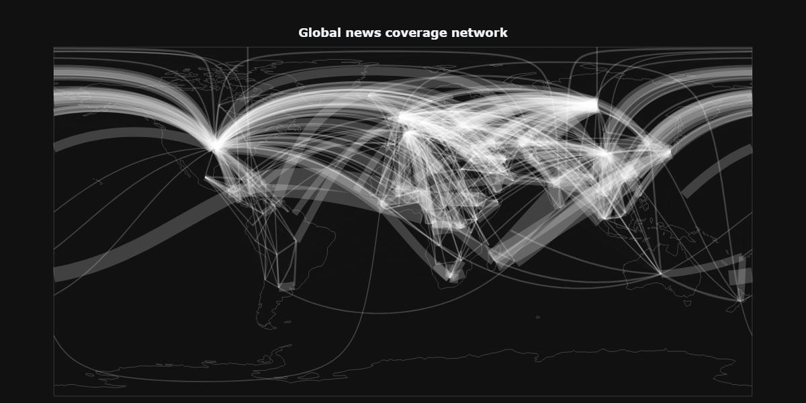

# The Value of Local News Sources for Conflict Forecasting: Predicting Changes in Violence Intensity in Afghanistan Using Themes in the Media

#### Author: Luuk Boekestein (AUC), luuk.boekestein@auc.nl
#### Supervisor: Jelke Bloem (UVA), j.bloem@uva.nl
#### Reader: Dr. ir. Jaap Kamps (UVA), j.kamps@uva.nl

## Abstract

Contemporary efforts to predict conflict are still limited by interpretability issues and low accuracy in hard prediction cases. In the face of these limitations, the conflict predicting field has turned towards the use of big data such as large news databases, which has generally yielded promising results. Nevertheless, the blind application of news-based features for conflict prediction exposes forecasts to significant risks, and this work argues that more attention should be paid to careful data selection. To highlight this point, this study investigates the relative predictive performance of over 6 million local, regional, and global news articles scraped from the Global Database of Events, Language, and Tone (GDELT), by training 7 different models that aim to predict changes in conflict intensity in Afghanistan. The results show that local models significantly outperform regional and global models, especially on shorter-term predictions and in cases of more drastic change. This indicates that local media are better at capturing early signs of tensions than non-local media, and calls for a more diversified forecasting approach. Finally, this study argues that although big data approaches to conflict prediction might achieve higher accuracy, smaller-scale, interpretable, and conceptually justified approaches should be prioritized in order for
the field to become a useful asset for preventing conflict.

_Keywords:_ armed conflict, prediction, machine learning, bias, media

See full report [here](reports/Final_paper.pdf).

## Information of repository

- For replication of the project, see the [predicting folder](src/Predicting/).
- The reports of this project can be found in the [reports folder](/reports/).

- For the documentation on the data sources used, see [data sources](docs/Data_sources.md).

- The data used in this project can be found in the [data folder](/data/).

- For vizualizations, see [vizualizations](docs/vizualizations.md).