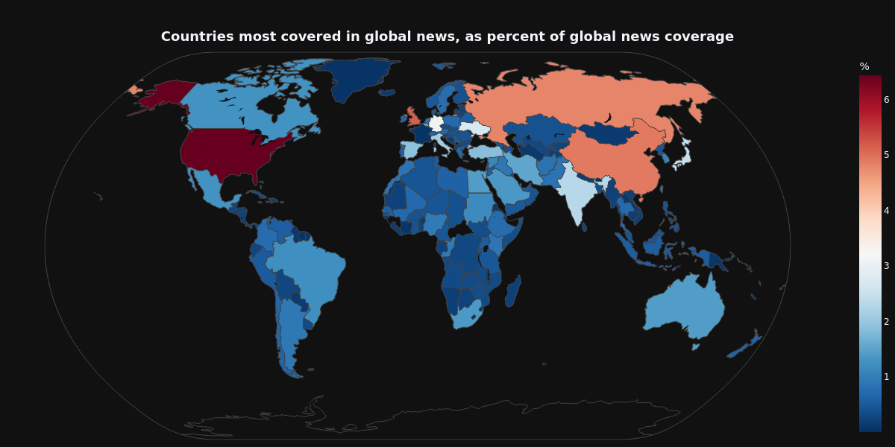

# Diversifying Media Sources For The Forecasting Of Armed Conflict: _Avoiding Biases In Violence Prediction Algorithms_

#### Author: Luuk Boekestein (AUC), luuk.boekestein@auc.nl
#### Supervisor: Jelke Bloem (UVA), j.bloem@uva.nl

## Abstract

The conflict-predicting field has advanced substantially in recent years, and state-of-the-art methods using machine learning are showing promising results. Yet, the field is still limited in its applicability for peacebuilding, due to low interpretability and low accuracy in tricky cases. Some have posed the incorporation of features from the media as a possible solution, due to its ability to provide more complete data and capture early signs of tensions. This has redirected attention in the field to big-data solutions, such as the event and sentiment data provided by the GDELT project. However, the blind application of media-based big data exposes prediction algorithms to biases and misinformation, which could produce dangerously misleading forecasts. Therefore, this paper argues that more attention must be paid to the careful selection of sources, and to substantiate the importance of this, proposes to investigate the relative predictive power of local and global news.

_Keywords:_ armed conflict, prediction, machine learning, bias, media

## Timeline of project

For a more detailed timeline and current TODO's, see [here](docs/TODO.md)

| Date  | What | Completed |
|---|---|---|
| March 13  | Research Proposal | Yes |
| April 10(?) | Writing Update  |   |
| May 8 | Draft of Thesis  |   |
| May 29 | Final Thesis |   |

## Information of repository

- The reports of this project can be found in the [reports folder](/reports/).

- For the documentation on the data sources used, see [data sources](docs/Data_sources.md).

- The data used in this project can be found in the [data folder](/data/).

- For vizualizations of the data used, see [vizualizations](docs/vizualizations.md).

## Methods

To investigate the biases in the GDELT database and the relative predictive value of local and global news coverage, this study will use the themes that GDELT codifies in its GKG database, rather than the events in the event database. As (Raleigh et al., 2023) argue, the event data are not a reliable source of conflict data, due to the many missing values and duplicate entries, but the themes that GDELT identifies may still be relatively reliable sources for tone and media focus (Raleigh et al., 2023). The themes are extracted using Latent theme identification (LTI), and categorized into labels that are found in GDELT’s labeling systems, or recognized taxonomies like CrisisLex or that of the World Bank Group (Saz-Carranza et al., 2020). GDELT contains news from sources from more than 200 countries and territories, but for this study, only a small subset of countries will be selected and treated as case studies. The selection criteria will be based on the cases of violence that a country has experienced in the period between 2017 and 2024, and in particular the amount of “hard cases” that have occurred. 
First, the themes in the worldwide coverage of these countries will be scraped through the GDELT DOC API. Following the article selection criteria of Mueller & Rauh (2022), an article will be considered to concern a country when it either mentions its name or the name of its capital. The data will then be preprocessed, and the intensity of the themes will be grouped and smoothed monthly for global, regional and local news coverage. Second, the study will apply different machine learning methods to the preprocessed theme data, in particular random forest models, as successfully applied by Mueller & Rauh (2022). It is expected that this will be the most successful method for prediction, but other machine-learning methods might be applied if deemed suitable. The study will aim to predict the countrywide change in conflict intensity on a monthly level, following the standard recommended by Hegre et al. (2022). For the reference of the intensity level this study will use data from the ACLED database, as it is widely recognized to be the most reliable and complete source of conflict statistics and has a high validity (Raleigh et al., 2010; Raleigh & Kishi, 2019). Finally, the study will evaluate the performance of different combinations of theme information, and evaluate our hypotheses.

## References

Hegre, H., Vesco, P., & Colaresi, M. (2022). Lessons From an Escalation Prediction Competition. International Interactions, 48(4), 1-34. https://doi.org/10.1080/03050629.2022.2070745

Mueller, H., & Rauh, C. (2022). Using past violence and current news to predict changes in violence. International Interactions, 48(4), 579-596. https://doi.org/10.1080/03050629.2022.2063853

Raleigh, C., & Kishi, D. R. (2019). Similarities and Differences Across Conflict Datasets. ACLED. https://www.acleddata.com/wp-content/uploads/2019/09/ACLED-Comparison_8.2019.pdf

Raleigh, C., Kishi, R., & Linke, A. (2023). Political instability patterns are obscured by conflict dataset scope conditions, sources, and coding choices. Humanities and Social Sciences Communications, 10(1), 1-17. https://doi.org/10.1057/s41599-023-01559-4

Raleigh, C., Linke, A., Hegre, H., & Karlsen, J. (2010). Introducing ACLED: An Armed Conflict Location and Event Dataset. Journal of Peace Research, 47(5), 651-660.

Saz-Carranza, A., Maturana, P., & Quer, X. (2020). The Empirical Use of GDELT Big Data in Academic Research (822654; p. 41). GLOBE. https://www.globe-project.eu/the-empirical-use-of-gdelt-big-data-in-academic-research_13809.pdf

