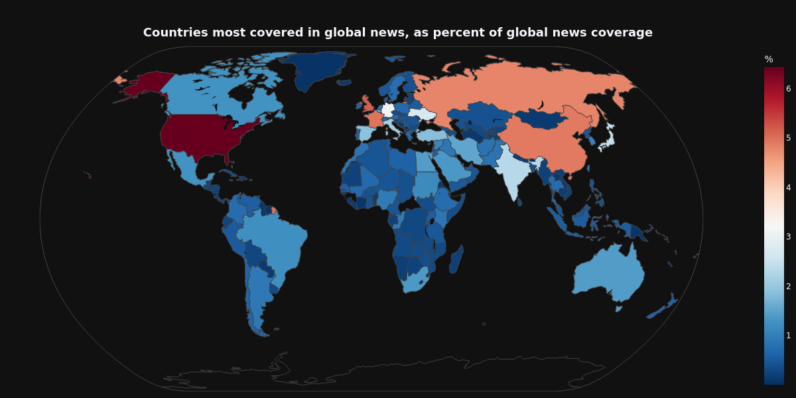
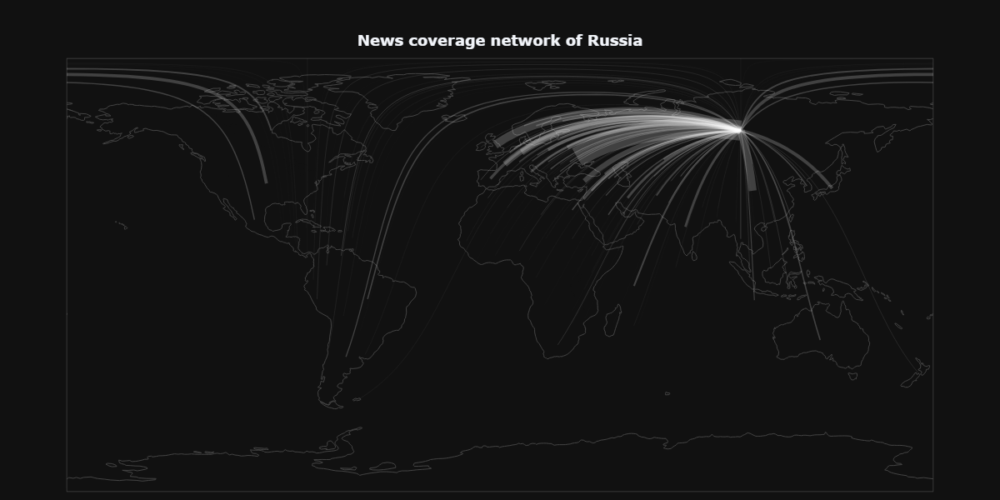
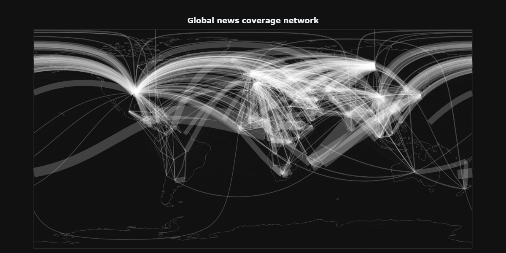

# Vizualizing the data

See this notebook for some experimental exploratory data analysis and vizualizations. The vizualizations here were made in the [vizualizations notebook](../data/newsdata/vizualizations.ipynb).

## GDELT news coverage

Firstly, we plotted the countries that are covered the most in the GDELT database. Below you can see the countries that are mentioned in news in other countries the most. _Note: this data has not been normalized properly, so might not be totally accurate_

Then, we can also make some interesting graphs, to show the network of news coverage. We can do it for individual countries, like the US, China, Russia and India:

| US | China |
|----|-------|
|  |  |

| Russia | India |
|----|-------|
|  |  |

We can also make this graph for the whole world, which gives us this:

